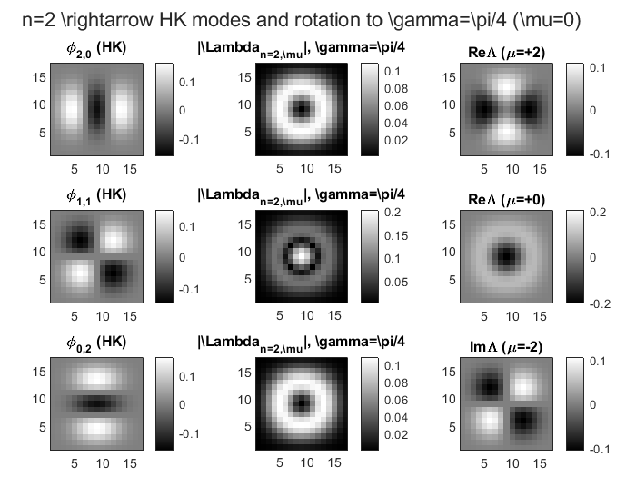
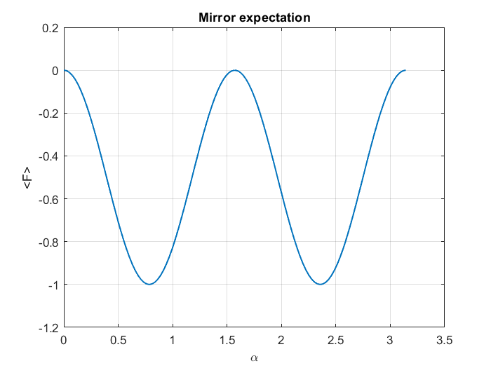

# Discrete Gyrator on 2D Hermite–Kravchuk Modes (MATLAB)

This repository implements the **discrete gyrator** (a rotation in the phase space) on the 2D **Hermite–Kravchuk (HK)** basis via the **SU(2)** representation—using **Wigner small‑d** coefficients. It includes an `n=2` demo at γ=π/4 and quick sanity checks for γ∈{0, π/2, π}.

> Why this matters: HK modes form a finite, orthonormal, pixel‑aligned basis on a square grid. The gyrator is unitary and mixes HK modes with weights given by Wigner-\(d\). This is a compact way to study discrete rotations in optical/quantum‑optics settings.

## Quick start (MATLAB R2022b+)
```matlab
addpath src, addpath demos
gyrator_hk_master;                 % N=16, gamma=pi/4
% or
[HK,LK,SHW,mgrid] = gyrator_hk_master(32, pi/6);
```

A minimal demo that saves a figure:
```matlab
addpath src, addpath demos
run('demos/demo_n2_pi4.m');        % writes figs/demo.png
```

<p align="center">
  
</p>

## Symmetry add-on: SU(2) rotations & Cₙ/Dₙ projectors

**What it is.** MATLAB add-on that adds symmetry operators to the gyrator (HK/LK) code:
- SU(2) rotations: `Rz`, `Ry` (Wigner little-d), `Rx = Rz(π/2) Ry Rz(−π/2)`.
- Symmetry projectors: cyclic **Cₙ** and dihedral **Dₙ** (with correct {k, −k} pairing).
- Mirror operator `F` and `x↔y` permutation `Pxy = Ry(π)`.

### Figures

<p float="left">
  <a href="figs/fractions_Cn_Dn.png">
    
  </a>
  <a href="figs/mirror_expectation.png">
    
  </a>
</p>

*From `demos/symmetry_scan_demo.m`: fractions \(E_k(\alpha)\), \(E_{k,\pm}(\alpha)\) and mirror expectation \(\langle F\rangle\).*


**Files.**
- `src/su2_hk_addon.m` – operators + projectors + reproducible tests **A–G**.
- `src/gyrator_hk_master.m` – base HK/LK + gyrator (used by the tests).
- `demos/symmetry_scan_demo.m` *(optional)* – sweeps of α to plot \(E_k(α)\), \(E_{k,±}(α)\).

## 🔗 Quick links

- **SU(2) tests (A–G)** → [`src/su2_hk_addon.m`](src/su2_hk_addon.m)
- **Symmetry scan demo** → [`demos/symmetry_scan_demo.m`](demos/symmetry_scan_demo.m)

### How to run
```matlab
clear functions; rehash; su2_hk_addon          % run tests A–G
run('demos/symmetry_scan_demo.m')              % run the symmetry demo

Figures (optional)
<p float="left"> <a href="figs/fractions_Cn_Dn.png">  </a> <a href="figs/mirror_expectation.png">  </a> </p> ```

**Quick start.**
```matlab
>> clear functions; rehash;
>> su2_hk_addon


## Contents
- `src/gyrator_hk_master.m` — **single-file** implementation with a master function and local subfunctions:
  - `gyrator_mode_eq27` — core SU(2) mixing using Wigner small‑d and phase convention
  - `hermiteKravchuk2D`, `kravchukOrthonormal` — orthonormal HK basis on a (N+1)×(N+1) grid
  - `wignerLittleD` — numerically stable Wigner \(d^j_{m,m'}(\beta)\), with special cases at \(\beta=0,\pi\)
- src/su2_hk_addon.m — SU(2) operators, Cₙ/Dₙ projectors, mirror/permutation, and tests A–G
- `demos/demo_n2_pi4.m` — 5‑line demo to generate the 3×3 figure
- demos/symmetry_scan_demo.m — symmetry-resolved plots E_k(alpha), E_{k,+/-}(alpha)
- `tests/quick_checks.m` — quick validation: identity at \(\gamma=0\); unit‑norm at \(\gamma=\pi/2,\pi\)

## Phase convention
We use the geometric phase \(e^{-i\pi\mu/4} e^{+i\pi\mu'/4}\) inside the sum and the global factor \(e^{+i\pi\mu/2}\) in the demo to match the paper’s plot conventions. The implementation is modular: you can switch conventions in one place if needed.

## Requirements
- MATLAB R2022b or newer; no toolboxes required.
- Tested on double‑precision grids up to `(N+1)=65` (N=64).

## License
MIT — see [`LICENSE`](LICENSE).

## Citation
If you use this in academic work, please cite us via the included `CITATION.cff` or a software reference in your methods section.
