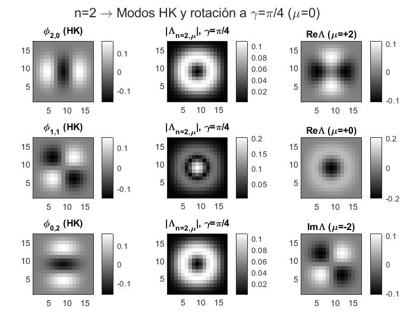

# Discrete Gyrator on 2D Hermite–Kravchuk Modes (MATLAB)

This repository implements the **discrete gyrator** (a rotation in the phase space) on the 2D **Hermite–Kravchuk (HK)** basis via the **SU(2)** representation—using **Wigner small‑d** coefficients. It includes an `n=2` demo at γ=π/4 and quick sanity checks for γ∈{0, π/2, π}.

> Why this matters: HK modes form a finite, orthonormal, pixel‑aligned basis on a square grid. The gyrator is unitary and mixes HK modes with weights given by Wigner-\(d\). This is a compact way to study discrete rotations in optical/quantum‑optics settings.

## Quick start (MATLAB R2022b+)
```matlab
addpath src, addpath demos
gyrator_hk_master;                 % N=16, gamma=pi/4
% or
[HK,LK,SHW,mgrid] = gyrator_hk_master(32, pi/6);
```

A minimal demo that saves a figure:
```matlab
addpath src, addpath demos
run('demos/demo_n2_pi4.m');        % writes figs/demo.png
```

<p align="center">
  
</p>

## Contents
- `src/gyrator_hk_master.m` — **single-file** implementation with a master function and local subfunctions:
  - `gyrator_mode_eq27` — core SU(2) mixing using Wigner small‑d and phase convention
  - `hermiteKravchuk2D`, `kravchukOrthonormal` — orthonormal HK basis on a (N+1)×(N+1) grid
  - `wignerLittleD` — numerically stable Wigner \(d^j_{m,m'}(\beta)\), with special cases at \(\beta=0,\pi\)
- `demos/demo_n2_pi4.m` — 5‑line demo to generate the 3×3 figure
- `tests/quick_checks.m` — quick validation: identity at \(\gamma=0\); unit‑norm at \(\gamma=\pi/2,\pi\)

## Phase convention
We use the geometric phase \(e^{-i\pi\mu/4} e^{+i\pi\mu'/4}\) inside the sum and the global factor \(e^{+i\pi\mu/2}\) in the demo to match the paper’s plot conventions. The implementation is modular: you can switch conventions in one place if needed.

## Requirements
- MATLAB R2022b or newer; no toolboxes required.
- Tested on double‑precision grids up to `(N+1)=65` (N=64).

## License
MIT — see [`LICENSE`](LICENSE).

## Citation
If you use this in academic work, please cite us via the included `CITATION.cff` or a software reference in your methods section.
